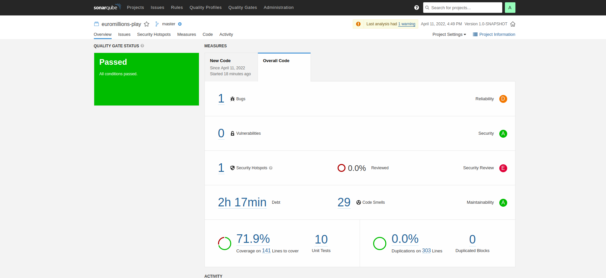
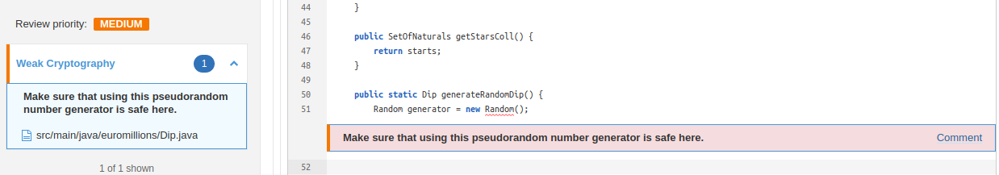
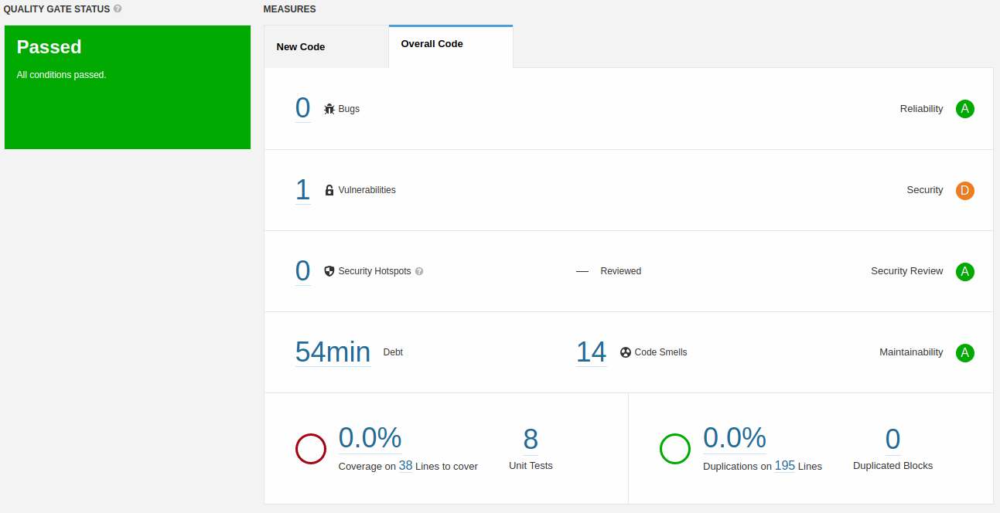
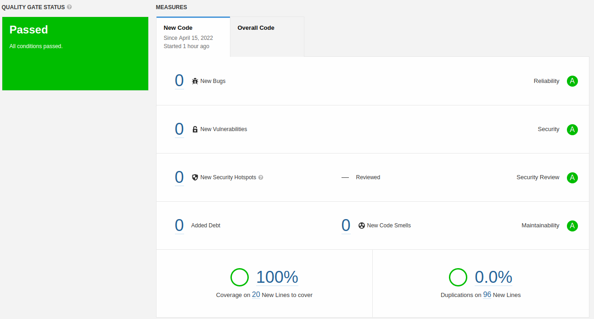

# Lab-6

## 6.2

### f)

According to the sonar analysis the code passed the quality gate test.

Although it has passed, we can see that it has a bug and a security hotspot (weak Cryptography)

### g)

|     **Issue**      |                              **Problem description**                              |                                                          **How to solve**                                                          |
| :----------------: | :-------------------------------------------------------------------------------: | :--------------------------------------------------------------------------------------------------------------------------------: |
|        Bug         |                         "Random" objects should be reused                         |                                                   Save and re-use this "Random"                                                    |
| Code smell (major) | A for loop stop condition should test the loop counter against an invariant value |                      Refactor the code in order to not assign to this loop counter from within the loop body.                      |
| Code smell (major) |           Standard outputs should not be used directly to log anything            |                                     Replace this use of System.out or System.err by a logger.                                      |
| Code smell (minor) |                 Modifiers should be declared in the correct order                 |                               Reorder the modifiers to comply with the Java Language Specification.                                |
| Code smell (minor) |         Declarations should use Java collection interfaces such as "List"         | Declarations should use Java collection interfaces such as "List" rather than specific implementation classes such as "LinkedList" |
| Code smell (minor) |                    The diamond operator ("<>") should be used                     |                     Replace the type specification in this constructor call with the diamond operator ("<>").                      |
| Code smell (info)  |      JUnit5 test classes and methods should have default package visibility       |                                                   Remove this 'public' modifier.                                                   |

## 6.3

Analysis of the copy of the “Cars” project from Lab #3.2:

After the code changes and refactoring:

### d)
